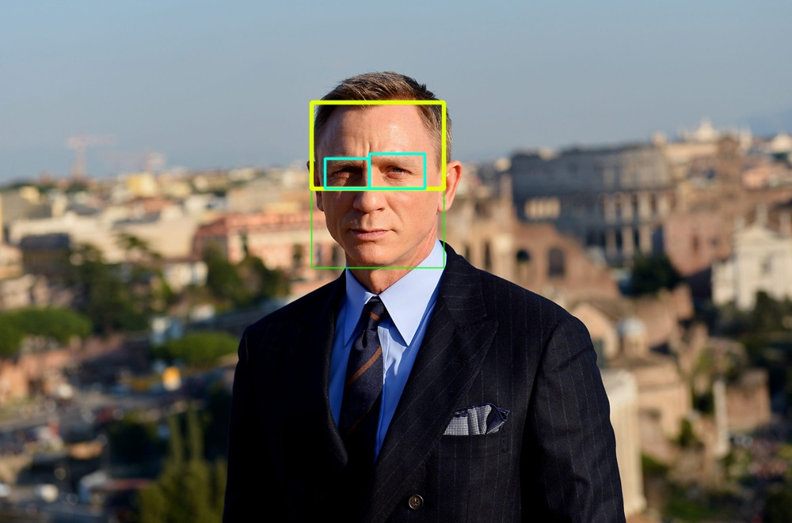

# Eyes Stable Detection with YOLOV5-Face and DenseNet Model

 
## Installation

Python environment (recommended)
<!-- <details><summary> <b>Expand</b> </summary> -->

``` shell
pip install requirements.txt
```
## Data 

Sample eyes stable data in [ggdrive](https://drive.google.com/file/d/1g-yyGRuvnez9Fru2l2lKgRNXYJPgU_08/view?usp=share_link)

Sample eyes stable face regconition in [ggdrive](https://drive.google.com/file/d/1YItFXysp9qKwikw2D3vfKv5V-QXz2FfJ/view?usp=share_link)

## Train Eyes Classification
``` shell
python train_eyes_stable.py --train_dir /content/data/train --val_dir /content/data/test --save_weights /content/weights --batch_size 32 --epochs 5
```
## Train Face Regconition
``` shell
python train_face_reg_co.py --data /content/all/ --tptrain train.xlsx --tptest test.xlsx --weights_folder /content/weights --batch_size 8 --epochs 5
```

## Train Weights
Download face [weights](https://drive.google.com/file/d/1YItFXysp9qKwikw2D3vfKv5V-QXz2FfJ/view?usp=share_link) to '/weights/'

## Run 
``` shell
# webcam
python main.py --source 0 --path_npy_file data/test.out --weights_eyes_stables weights/Eyes_stable_model_best_07-0.04.hdf5 --weights_face_reg weights/Embedding_DenseNet.hdf5

# video 
python main.py --source data/video-f1b7c41a-0add-4af1-adb7-2e7b8c7e4e67-1665057340.mp4 --path_npy_file data/test.out --weights_eyes_stables weights/Eyes_stable_model_best_07-0.04.hdf5 --weights_face_reg weights/Embedding_DenseNet.hdf5
```
